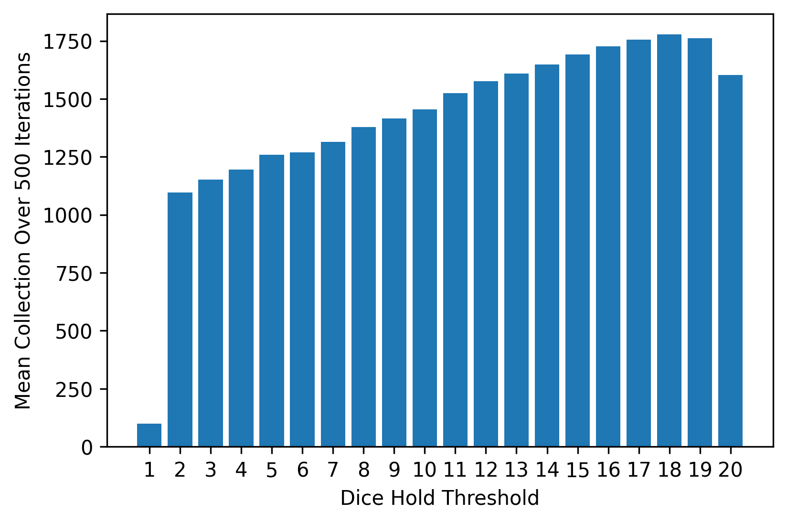
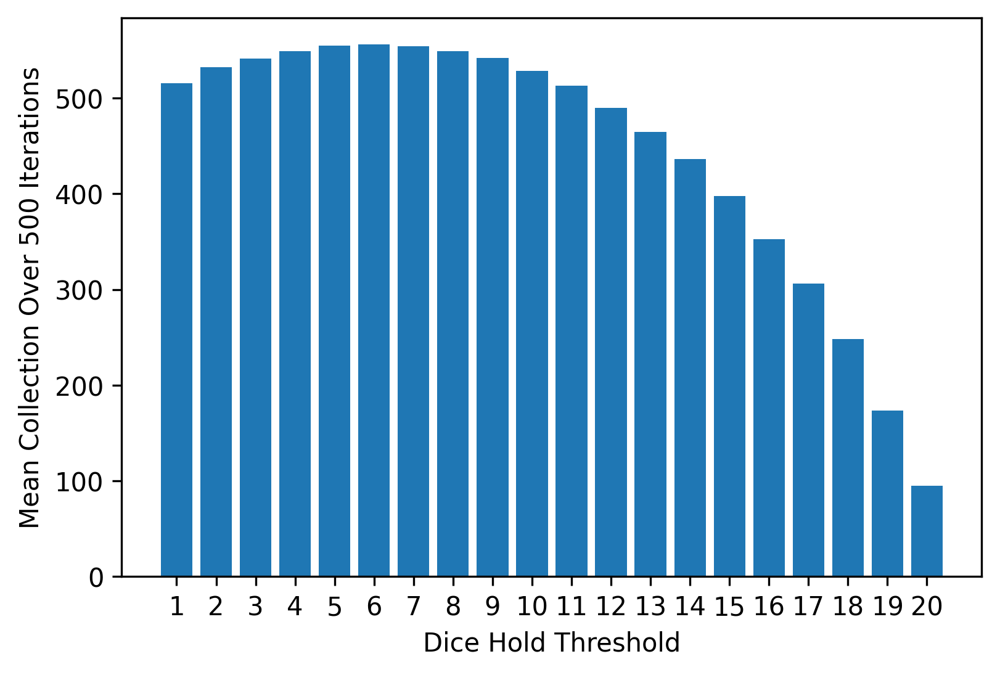

A simple numerical solution to parts 1 and 2 of the [Jane Street mock interview published on November 8th, 2022](https://youtu.be/NT_I1MjckaU)

I may at some point in the future do something for part 3.


The output solution to part 1.


This is the output solution to part 2.

And the console output:
```
Optimal Hold: 18
With Value: $1777.236

Optimal Part 2 Hold: 6
With Value: $556.036
```